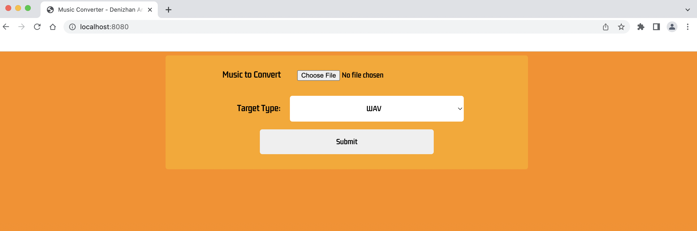

# Spring Audio Converter

- Spring Boot, Thymeleaf
- System supports WAV, AU, AIFF upload & conversions.
- Project Serves at: ```http://localhost:8080```
- To run project on local:
    - Import project with maven, Run from your IDE.

## Convert Screen
- To enter the Convert Screen navigate: ```http://localhost:8080``` from your browser.
- From this screen you can upload your audio file, select the target type and click the convert button.
- Your converted audio file will be downloaded automatically when it is ready.



